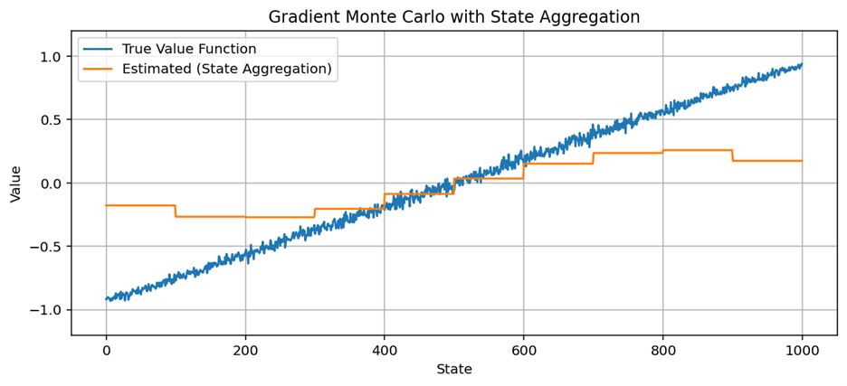
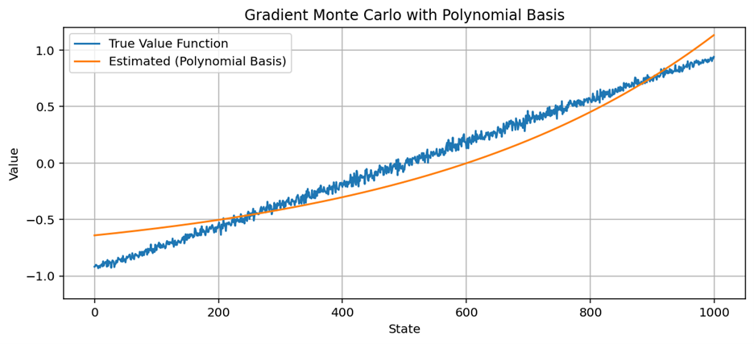
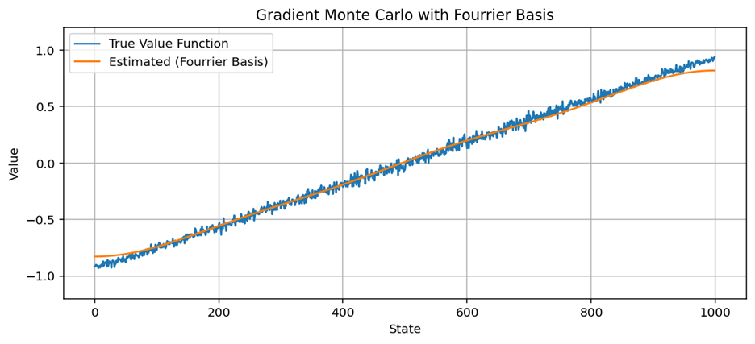
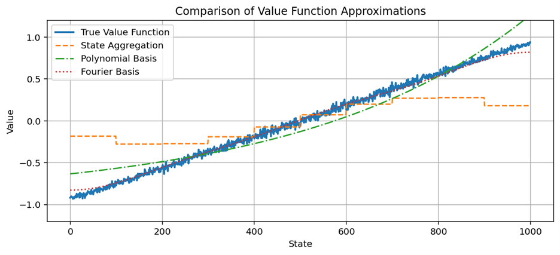

# Gradient Monte Carlo Prediction
This project implements **gradient Monte Carlo prediction** for estimating value functions in a random walk environment. It compares different function approximation strategies using a 1000-state domain. An agent performs a random walk from state 500 in a 1000-state environment. At each step, it moves randomly left or right by 1–100 states. Episodes terminate if the agent goes beyond the boundaries.

It includes:
- Custom 1000-state Random Walk Environment
- Monte Carlo rollouts to estimate ground truth value function
- Gradient Monte Carlo learning with:
  - State Aggregation
  - Polynomial Basis
  - Fourier Basis

## Author
Serge Alhalbi

## Company
The Ohio State University

## Tools and Libraries
- Python

## Usage
```bash
git clone https://github.com/SergeAlhalbi/gradient-monte-carlo-prediction.git
cd gradient-monte-carlo-prediction
```

## Results
Below are examples of value function approximations:

- **State Aggregation vs Ground Truth**

  

- **Polynomial Basis**

  

- **Fourier Basis**

  

- **Comparison Across Methods**

  
